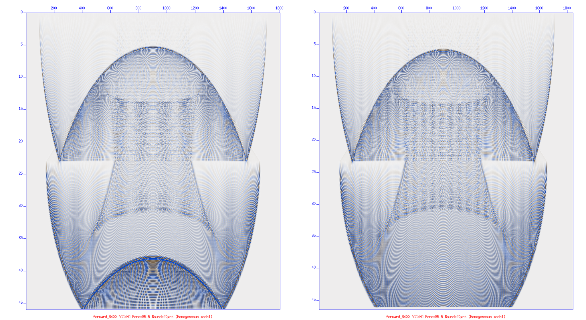

### Introduction:
Reverse Time Migration (RTM) is a powerful seismic imaging approach, widely used for migrating areas of complex structures of steep-dips and subsalt regions, despite its high computational cost. As in our work we are solving the isotropic acoustic  2nd order wave equation using explicit time domain finite differences (FD), we can identify the most computational part as follows : The FD kernel by itself , the boundary condition, the way we handle snapshots and the communication between domains.

Following previous work where we did show FD kernel optimizations and different techniques to keep the snapshots (with or without IO or compression), we are now reporting some results on boundary conditions taking into consideration the trade-offs between the geophysical effects and utilization of computational elements.Moreover, finding the optimal solution between computational cost and efficiency of a boundary condition algorithm and its effectiveness in attenuating unwanted energy.
 
Theoretically, waves propagate their extends to infinity or continue until vanishing. Unfortunately, this is not applicable in modeling a particular region since we truncate model to a computational grid modeling a region of interest. Absorbing all incoming energy at the boundaries of the computational grid mimic a real-life infinite media. Many approaches attempt to mimic different kinds of absorbing boundary conditions (ABC) e.g. Sponge, PML, random boundaries, etc.  

Here, we review 2 RTM implementations, in addition to the compression capable version. One is using the standard approach (2 propagations with in-memory snapshots of the full wavefield) covering Sponge and CPML boundary conditions, while the second implementation uses random velocity boundaries  that almost avoid IO but involves an extra propagation.
We already demonstrated,in our previous report, the efficiency tradeoff of those implementations so now we can typically balance the number of grid points in the damping area to find the best combination with respect to the efficiency of the rest of the RTM implementations and present a complete comparison of the damped energy with varying boundaries lengths.

### Boundary conditions:
Theoretically, waves propagate their extends to infinity or continue until vanishing. Unfortunately, this is not applicable in modeling a particular region since we truncate model to a computational grid modeling a region of interest. Absorbing all incoming energy at the boundaries of the computational grid mimic a real-life infinite media.
 
Investing time in the boundary conditions was crucial to increase the accuracy of the overall domain without compromising the runtime and speedup gain from our previous work. We emphasize the analysis between different boundary conditions to find out the best quality of attenuation while taking into consideration a minimal number of extra grid points appended to the overall domain, categorizing the boundary conditions into two areas, firstly the “physical attenuation”, such as, dispersion in the case of Random Velocity boundaries and secondly the “artificial attenuation”, such as, damping in the case of Absorbing boundaries or Perfectly Matching Layer.

RTM seismic imaging concept is revolved around cross correlating a forward simulated source wavefield and a backward propagated seismic data, i.e., correlating between a simulation made from some physical attributes and the real data acquired after processing and cleansing.
 
Concerned about limitations in the computer memory, boundary conditions are introduced to serve as a limiting parameter for the propagated waves wandering through the domain and preventing unwanted reflections to generate when waves reach the boundaries, as shown below in both figures; the left figure contains a boundary condition implementation, and the right figure has no boundary condition.

There is a profound distinguishment between the lower part of both figures, the unwanted reflection is quite noticed in the right (no boundary conditioned) figure. This will affect the overall migration, the noisy error will propagate through all the domain which can end up messing and interfering the stacked image.

###Overview of the total energy damped side-by-side with the elapsed time: how far could we reasonably go!
There are three absorbing boundary conditions which was investigated throughout the analysis; The first boundary condition is the Sponge, being one of the earliest boundary conditions, Sponge has many formulations, however, the overall idea behind it is to damp the energy exponentially in a region stretched from the domain where the wave is going to depreciate with respect to the number of boundary points, the second boundary condition, is the Random Velocity boundaries, this is simple and have minimal computational time because it depends entirely on stretching the domain and randomising the velocities of this stretched region, neither any overhead calculation nor an additional damping term is required for fulfilling its criteria, ideally this might prevent any unwanted reflected waves, on the other hand it is highly dependable upon the randomization peer of the velocity used, last but not least is the PML, placing a particular damping coefficient at the edges of the model, upon propagating through PML, the wave starts to attenuate and decay exponentially, wave’s amplitude will become infinitely small as it reaches back the grid after reflecting from the boundary, one of the astonishing aspects of PML is that it’s capable of handling all types of waves, surprisingly, graving incident waves.

Whereas the random boundaries don’t introduce considerable amount of overhead in the calculations. We will differentiate between Sponge and CPML, considering the total energy in the model, the number of boundary points used and the elapsed timings in the figure below:

Furthermore clarifying the differences between the three implementations, taking into consideration that there is no AGC(automatic gain control) applied; as shown in  the following Fig.

Explaining how the energy damps while moving through the boundary region in the below figure we used the BP model(Energy damping comparison; Sponge, random boundary and CPML respectively)

As we increase the boundary points inside the boundary region, the energy decreases with a criterion that emphasizes the point of a previous figure that increasing points beyond 16 won’t help attenuating the reflections, on the contrary, it would slow down the propagation due to CPML oncost calculations. Comparing the three boundary conditions together upfront would illustrate the advantages of the CMPL over Random and Sponge boundary condition implementations.

After the explanation of the results and differentiating between the outcome of the three different boundary conditioning techniques from the geophysical point of view, we are going to highlight the performance of the techniques from the computational perspective, as to show how did it influence the overall system performance in the below figure:

The first three bar charts show the difference between them according to the elapsed time for the two main modules, such as the Forward propagation, the Backward and the overall overhead generated by each condition. It’s obvious that CPML takes the longest time and highest overhead.
Wrapping up the results of the boundary condition analysis while keeping in mind that all conditions are valid for 3D propagation, we came to the conclusion that using CPML will definitely enhance the accuracy and quality of the seismic imaging from a geophysical point of view, however, increasing the number of boundary points would significantly prolong the computational time which will choke the performance, might be even comparable to the propagation time itself and become a bottleneck in the implementation. 
Sponge boundary condition is relatively easy to implement, in addition to having fewer calculations, but on the other hand it needs further much more points to be geophysically accepted. Random boundary is hard to get a grip on, i.e., tricky to tune, however, it’s the only condition that’s physically attenuating the wave.

CPML roofline analysis shows that a number of the loops are bounded by the memory bandwidth. The most intensive compute components; step convolution and stencil kernel; are just above the memory line. This clearily indicate that the cache blocks are not optimized and need more tuning.

### Hint:
There is a bug in this implementation: Source injection is not implemented correctly, this causes the energy to go down and up with some numerical dispersion in the displayed images

 